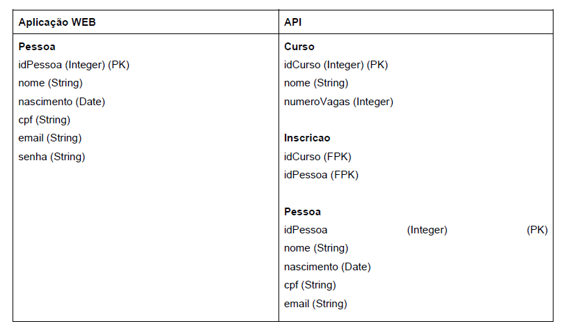

# Projeto Full-Stack com Java, JWT, React e RabbitMQ

## Descrição Geral

Este projeto foi desenvolvido como parte de um estudo de caso para um sistema completo que gerencia usuários, cursos e inscrições. Ele envolve três componentes principais:

1. **Frontend**: Interface desenvolvida em React (em andamento).
2. **Backend**: API RESTful construída com Java 21 e Spring Boot.
3. **Mensageria**: Integração assíncrona utilizando RabbitMQ (em desenvolvimento).

---

## Tecnologias Utilizadas

<p align="center">
  
  
  
  
  
  
  
</p>

---

## Funcionalidades Principais

1. **Autenticação**:
   - Implementada com **JWT (JSON Web Token)** para segurança e controle de acesso.
2. **Cadastro e Gerenciamento**:
   - CRUD completo para usuários, cursos e inscrições.
3. **Mensageria**:
   - Utilização de **RabbitMQ** para comunicação assíncrona (em andamento).
4. **Atualização em Tempo Real**:
   - Atualizações ao vivo usando WebSocket ou Server-Sent Events (SSE).
5. **Documentação**:
   - A API está documentada com Swagger, acessível em `/swagger-ui`.

---

## Configuração e Execução

### Requisitos

- **Java 21**
- **Node.js**
- **Docker e Docker Compose**
- **PostgreSQL**

### Instruções

1. Clone o repositório:
   ```bash
   git clone <https://github.com/anthonyMeds/fullStackProject-v1.git>

2. Suba os serviços: 
   ```bash
   docker-compose up

3. Acesse a Documentação da API : http://localhost:8080/swagger-ui

### Estrutura do Repositório
   ```bash
   /projeto
   ├── frontend/                # Código do frontend em React
   ├── backend/                 # Código do backend em Java
   ├── api/                     # Serviços REST da API
   ├── docker-compose.yml       # Configuração do ambiente Docker
   └── README.md                # Documentação do projeto
   ```

### Arquitetura da aplicação :

<p align="center">  </p>

### Banco de dados: 
<p align="center">  </p>

### Endpoints Principais :

## Endpoints

| Método HTTP          | Descrição                              | Request                                                                                  | Response                                                                                 |
|----------------------|--------------------------------------|------------------------------------------------------------------------------------------|------------------------------------------------------------------------------------------|
| **POST /pessoa**     | Cadastra a pessoa na API              | `{ "nome": "String", "nascimento": "Date", "cpf": "String", "email": "String" }`         | `{ "idPessoa": "Integer", "mensagem": "String" }`                                       |
| **GET /curso**       | Retorna todos os cursos da API        | Sem parâmetros                                                                          | `{ "idCurso": "Integer", "nomeCurso": "String", "numeroVagas": "Integer", "numeroInscricoes": "Integer" }` |
| **POST /curso**      | Insere o curso na base de dados da API (via Postman) | `{ "nome": "String", "numeroVagas": "Integer" }`                                        | `{ "idCurso": "Integer", "mensagem": "String" }`                                       |
| **POST /inscricao**  | Inscreve um candidato no curso        | `{ "idCurso": "Integer", "cpf": "Integer" }`                                            | `{ "mensagem": "String" }`                                                              |
| **GET /inscritos/{idCurso}** | Retorna os candidatos inscritos no curso | `idCurso` (URL Parameter)                                                               | `{ inscritos: [ { "cpf": "String" } ] }`                                                |


## Telas do Sistema (Em desenvolvimento)

### Tela de Login
<p align="center">  </p>

### Cadastro de Pessoa
<p align="center">  </p>

### Incrição em cursos
<p align="center">  </p>

---

### RabbitMQ (em desenvolvimento)

